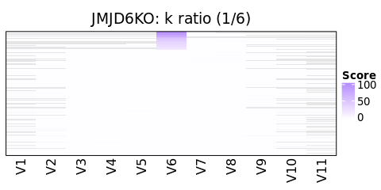

j4 de novo data analysis
================
Yoichiro Sugimoto
22 December, 2021

  - [Load packages](#load-packages)
  - [Pre-process peptide data](#pre-process-peptide-data)
  - [Analysis](#analysis)

# Load packages

``` r
library("Biostrings")
```

    ## Loading required package: BiocGenerics

    ## Loading required package: parallel

    ## 
    ## Attaching package: 'BiocGenerics'

    ## The following objects are masked from 'package:parallel':
    ## 
    ##     clusterApply, clusterApplyLB, clusterCall, clusterEvalQ,
    ##     clusterExport, clusterMap, parApply, parCapply, parLapply,
    ##     parLapplyLB, parRapply, parSapply, parSapplyLB

    ## The following objects are masked from 'package:stats':
    ## 
    ##     IQR, mad, sd, var, xtabs

    ## The following objects are masked from 'package:base':
    ## 
    ##     anyDuplicated, append, as.data.frame, basename, cbind, colnames,
    ##     dirname, do.call, duplicated, eval, evalq, Filter, Find, get, grep,
    ##     grepl, intersect, is.unsorted, lapply, Map, mapply, match, mget,
    ##     order, paste, pmax, pmax.int, pmin, pmin.int, Position, rank,
    ##     rbind, Reduce, rownames, sapply, setdiff, sort, table, tapply,
    ##     union, unique, unsplit, which, which.max, which.min

    ## Loading required package: S4Vectors

    ## Loading required package: stats4

    ## 
    ## Attaching package: 'S4Vectors'

    ## The following object is masked from 'package:base':
    ## 
    ##     expand.grid

    ## Loading required package: IRanges

    ## Loading required package: XVector

    ## 
    ## Attaching package: 'Biostrings'

    ## The following object is masked from 'package:base':
    ## 
    ##     strsplit

``` r
temp <- sapply(list.files("../functions", full.names = TRUE), source)
```

    ## 
    ## Attaching package: 'dplyr'

    ## The following objects are masked from 'package:Biostrings':
    ## 
    ##     collapse, intersect, setdiff, setequal, union

    ## The following object is masked from 'package:XVector':
    ## 
    ##     slice

    ## The following objects are masked from 'package:IRanges':
    ## 
    ##     collapse, desc, intersect, setdiff, slice, union

    ## The following objects are masked from 'package:S4Vectors':
    ## 
    ##     first, intersect, rename, setdiff, setequal, union

    ## The following objects are masked from 'package:BiocGenerics':
    ## 
    ##     combine, intersect, setdiff, union

    ## The following objects are masked from 'package:stats':
    ## 
    ##     filter, lag

    ## The following objects are masked from 'package:base':
    ## 
    ##     intersect, setdiff, setequal, union

    ## 
    ## Attaching package: 'data.table'

    ## The following objects are masked from 'package:dplyr':
    ## 
    ##     between, first, last

    ## The following object is masked from 'package:IRanges':
    ## 
    ##     shift

    ## The following objects are masked from 'package:S4Vectors':
    ## 
    ##     first, second

``` r
source("../../R/j2-PTM-stoichiometry/functions/stoichiometry_functions.R")

results.dir <- file.path("../../results")
j4.res.dir <- file.path(results.dir, "j4-de-novo-data-analysis")

create.dirs(c(
    j4.res.dir
))

processors <- 8
```

# Pre-process peptide data

Note that the dummy data will be inserted for the PTM column, and thus
the statistics for “All PTMs” are not meaningful here.

``` r
j4.input.dir <- file.path("../../data/j4-de-novo-data")

peptide.wt.dt <- fread(file.path(j4.input.dir, "HeLa_peptide_de_novo_peptides.csv"))
peptide.j6ko.dt <- fread(file.path(j4.input.dir, "J6KO_peptide_de_novo_peptides.csv"))
jq1.wt.dt <- fread(file.path(j4.input.dir, "HeLa_JQ1_de_novo_peptides.csv"))
jq1.j6ko.dt <- fread(file.path(j4.input.dir, "J6KO_JQ1_de_novo_peptides.csv"))

peptide.wt.dt[, `:=`(PD = "peptide", JMJD6 = "WT")]
peptide.j6ko.dt[, `:=`(PD = "peptide", JMJD6 = "JMJD6KO")]
jq1.wt.dt[, `:=`(PD = "JQ1", JMJD6 = "WT")]
jq1.j6ko.dt[, `:=`(PD = "JQ1", JMJD6 = "JMJD6KO")]

all.dt <- rbindlist(list(peptide.wt.dt, peptide.j6ko.dt, jq1.wt.dt, jq1.j6ko.dt))
all.dt[
  , conf_score := list(str_split(get("local confidence (%)"), " ")),
    by = seq_len(nrow(all.dt))
]

all.dt[, `:=`(
    data_source = paste0(PD, "_", JMJD6),
    Unique = "Y",
    Area = 100,
    PTM = "Oxidation (K); Oxidised Propionylation", # keep all KOH
    Accession = 1
)]

## Dummy data
all.protein.feature.per.pos.dt <- data.table(Accession = 1)

all.dt <- filterPeptideData(all.dt)
```

    ## [1] "Input peptides per data_sources"
    ## data_source
    ##     JQ1_JMJD6KO          JQ1_WT peptide_JMJD6KO      peptide_WT 
    ##          136947          128674          608508          585643 
    ## [1] "Peptides per data_sources after filteration 1"
    ## data_source
    ##     JQ1_JMJD6KO          JQ1_WT peptide_JMJD6KO      peptide_WT 
    ##          136947          128674          608508          585643 
    ## [1] "Peptides per data_sources after filtration 2"
    ## data_source
    ##     JQ1_JMJD6KO          JQ1_WT peptide_JMJD6KO      peptide_WT 
    ##          136947          128674          608508          585643 
    ## [1] "After the filtration of acetylation (filteration 3)"
    ## [1] "All K related modifications"
    ## 
    ##         K K(+15.99) K(+56.03) K(+72.02) 
    ##    528505    113893   1110613    128881 
    ## [1] "All R related modifications"
    ## 
    ##       R 
    ## 1322888 
    ## [1] "All PTMs"
    ## 
    ##           Oxidation (K) Oxidised Propionylation 
    ##                 1459772                 1459772 
    ## [1] "Peptides per data_sources after filtration 4"
    ## data_source
    ##     JQ1_JMJD6KO          JQ1_WT peptide_JMJD6KO      peptide_WT 
    ##          135149          126499          598079          575171 
    ## [1] "Peptides per data_sources after filtration 5"
    ## data_source
    ##     JQ1_JMJD6KO          JQ1_WT peptide_JMJD6KO      peptide_WT 
    ##          123237          117908          570704          548744 
    ## [1] "Filtration 5 (PTM assignment)"
    ## [1] "All K related modifications"
    ## 
    ##         K K(+15.99) K(+56.03) K(+72.02) 
    ##    425535     75981   1013481    110077 
    ## [1] "All R related modifications"
    ## 
    ##       R 
    ## 1203139 
    ## [1] "All PTMs"
    ## 
    ##           Oxidation (K) Oxidised Propionylation 
    ##                 1360593                 1360593

``` r
## Peptides which does not contain K were excluded
all.dt <- all.dt[str_count(Peptide, "K") > 0]

all.dt[, `:=`(
  PSM_hydroxy = gsub("(K\\(\\+15.99\\)|K\\(\\+72.02\\))", "x", Peptide) %>%
      {gsub("\\s*\\([^\\)]+\\)","", .)} %>%
      {gsub("x","K(+15.99)", .)}
)]

all.dt[, summary(length)]
```

    ##    Min. 1st Qu.  Median    Mean 3rd Qu.    Max. 
    ##    4.00   10.00   12.00   13.44   16.00   48.00

``` r
fwrite(
    all.dt[
        grepl("K\\(\\+15.99\\)", PSM_hydroxy)
    ][JMJD6 == "WT"][
      , .(JMJD6, PSM_hydroxy)
    ],
    file.path(j4.res.dir, "de-novo-hydroxylation-site.txt"),
    sep = "\t"
)

## This is for the development purpose
set.seed(1)

save(
    all.dt,
    file = file.path(j4.res.dir, "test-de-novo-hydroxylation-site.Rdata")
)
```

# Analysis

Below are dummy data only used for test.

``` r
## dummy.peptide <- c(
##     "KKKKKKKKKK", #K10
##     "KKHKKKKK", #K2HK5
##     "KHHHKHH", #K1H3KH2
##     "KHKKKKKKKKH", #KHK8H
##     "KHKKKKKKKKHHKKKKKK", #KHK8H
##     "HKKKKKK",
##     "KKKKKKH"
## )

## all.dt <- data.table(
##     raw_peptide = dummy.peptide,
##     k_info_peptide = dummy.peptide,
##     conf_score = list(
##         1:10*10,
##         c(10, 10, 80, rep(10, times = 5)),
##         c(10, 40, 80, 60, 10, 80, 70),
##         c(10, 80, rep(10, times = 8), 80),
##         c(10, 80, rep(10, times = 8), 40, 40, rep(10, times = 6)),
##         c(80, rep(10, times = 6)),
##         c(rep(10, times = 6), 80)
##     ),
##     length = nchar(dummy.peptide)
## )
```

Actual analysis will be performed here

``` r
window.size <- 6
denovo.score.cutoff <- 50

all.dt <- all.dt[
    length >= window.size &
    get("Denovo Score") >= denovo.score.cutoff
]

K.probs.list <- mclapply(
    AAStringSet(all.dt[, raw_peptide]),
    letterFrequencyInSlidingView,
    view.width = window.size, letters = "K", as.prob = TRUE,
    mc.cores = processors
)

k.max.probs <- mclapply(
    K.probs.list,
    max,
    mc.cores = processors
) %>% unlist # So to speak K ratio

oxK.pos.list <- mclapply(
    AAStringSet(all.dt[, k_info_peptide]),
    letterFrequencyInSlidingView,
    view.width = 1, letters = "H", as.prob = TRUE,
    mc.cores = processors
)

## Sliding widow for OxK
ra.oxK.score <- mcmapply(
    function(x, y){
        c(
            rep(0, times = window.size - 1),
            ifelse(x[, "H"] == 1, as.integer(y), 0),
            rep(0, times = window.size - 1)
        ) %>%
            {zoo::rollapply(., window.size, sum)}
    },
    oxK.pos.list,
    all.dt[, conf_score],
    SIMPLIFY = FALSE,
    mc.cores = processors
) # oxK score for 6 mer sliding window

ra.oxK.max.score <- mclapply(
    ra.oxK.score,
    max,
    mc.cores = processors
) %>% unlist # max oxK score per peptide

centre.longest.stretch <- function(z){
    consec.dt <- with(rle(z), {
        ok <- values == TRUE
        ends <- cumsum(lengths)[ok]
        starts <- ends - lengths[ok] + 1
        cbind(starts, ends)
    }) %>% data.table

    consec.dt[, consec_width := ends - starts]
    consec.dt <- consec.dt[consec_width == max(consec_width)]
    center.index <- consec.dt[1, floor((starts + ends) / 2)]
    ## consec.dt[ends - starts == max(consec.dt[, ends - starts])][1, ends]
    ## This one return the last occurence,
    ## Fix the effect of paddling
    center.index <- center.index - (window.size - 1) +
        round(window.size / 2)
    return(center.index)
}

ra.oxk.max.score.index <- mcmapply(
    function(x, y){
        centre.longest.stretch(x == y)
    },
    ra.oxK.score,
    ra.oxK.max.score,
    mc.cores = processors
) # starting position of sliding window that maximises oxK score

K.pos.list <- mclapply(
    AAStringSet(all.dt[, raw_peptide]),
    letterFrequencyInSlidingView,
    view.width = 1, letters = "K", as.prob = TRUE,
    mc.cores = processors
)

score.dt <- mcmapply(
    function(
             conf.score, oxk.score, oxk.index,
             k.pos, oxk.pos,
             score.dt.window.size = window.size - 1,
             theoritical.max.window.size = 100
             ){
        
        oxk.conf.score.vec <- case_when(
            oxk.pos[, "H"] == 1 ~ as.numeric(conf.score),
            k.pos[, "K"] == 1 ~ 1,
            TRUE ~ 0
        )

        out <- rep(NA, times = 2 * theoritical.max.window.size + 1)

        out[
        (theoritical.max.window.size + 1 - oxk.index + 1):
        (theoritical.max.window.size + 1 + length(oxk.pos[, "H"]) - oxk.index)
        ] <-
            oxk.conf.score.vec

        out <- out[
        (theoritical.max.window.size - score.dt.window.size + 1) :
        (theoritical.max.window.size + score.dt.window.size + 1)
        ]
        
        data.table(matrix(out, nrow = 1))
    },
    conf.score = all.dt[, conf_score], # List of confidence score
    oxk.score = ra.oxK.max.score, 
    oxk.index = ra.oxk.max.score.index, # Starting position of 6 mer window that gives the maximum oxK score 
    k.pos = K.pos.list,
    oxk.pos = oxK.pos.list,
    theoritical.max.window.size = all.dt[, max(nchar(raw_peptide))] * 2,
    SIMPLIFY = FALSE,
    mc.cores = processors
) %>%
    rbindlist

all.dt[, `:=`(
    max_K_ratio = k.max.probs,
    max_oxK_score = ra.oxK.max.score
)]

all.score.dt <- cbind(all.dt, score.dt)

all.score.dt[, K_count := round(max_K_ratio * window.size)]

basic.stats <- all.score.dt[
  , .N, by = list(
            JMJD6,
            K_count, oxK = ifelse(max_oxK_score > 0, "oxK", "no_oxK")
        )
][order(JMJD6, K_count, oxK)] %>%
    dcast(JMJD6 + K_count ~ oxK, value.var = "N") %>%
    {.[, total_n := oxK + no_oxK]}

print(basic.stats)
```

    ##       JMJD6 K_count no_oxK   oxK total_n
    ##  1: JMJD6KO       1 282508 48829  331337
    ##  2: JMJD6KO       2  93194 31137  124331
    ##  3: JMJD6KO       3  19469  6082   25551
    ##  4: JMJD6KO       4   3347   774    4121
    ##  5: JMJD6KO       5    303    23     326
    ##  6: JMJD6KO       6      4     3       7
    ##  7:      WT       1 265173 47119  312292
    ##  8:      WT       2  87816 30237  118053
    ##  9:      WT       3  18832  6091   24923
    ## 10:      WT       4   3345   931    4276
    ## 11:      WT       5    195    83     278
    ## 12:      WT       6      3    NA      NA

``` r
all.score.dt[, `:=`(
    K_count_capped = case_when(
        K_count < 5 ~ as.character(K_count),
        TRUE ~ "5+"
    ) %>%
        factor(levels = c(as.character(1:4), "5+"))
)]

basic.stats.2 <- all.score.dt[
  , .N, by = list(
            JMJD6,
            K_count_capped, oxK = ifelse(max_oxK_score > 0, "oxK", "no_oxK")
        )
][order(JMJD6, K_count_capped, oxK)] %>%
    dcast(JMJD6 + K_count_capped ~ oxK, value.var = "N") %>%
    {.[, total_n := oxK + no_oxK]}

print(basic.stats.2)
```

    ##       JMJD6 K_count_capped no_oxK   oxK total_n
    ##  1: JMJD6KO              1 282508 48829  331337
    ##  2: JMJD6KO              2  93194 31137  124331
    ##  3: JMJD6KO              3  19469  6082   25551
    ##  4: JMJD6KO              4   3347   774    4121
    ##  5: JMJD6KO             5+    307    26     333
    ##  6:      WT              1 265173 47119  312292
    ##  7:      WT              2  87816 30237  118053
    ##  8:      WT              3  18832  6091   24923
    ##  9:      WT              4   3345   931    4276
    ## 10:      WT             5+    198    83     281

``` r
all.score.dt <- all.score.dt[
    order(- K_count_capped, - max_oxK_score)
]

all.score.file <- file.path(
    j4.res.dir, paste0(
                         "all_score_",
                         window.size, "_", denovo.score.cutoff
                       , ".csv"
                     ))

fwrite(
    all.score.dt,
    all.score.file
)

## For QC
all.score.dt[, c(
    "data_source", "max_oxK_score",
    "K_count_capped", "Peptide", "Denovo Score", "local confidence (%)"
), with = FALSE][
    K_count_capped == "5+"
][grepl("WT$", data_source)] %>%
    fwrite(file = file.path(j4.res.dir, "K_score_5or6_WT.csv"))

all.score.dt[, c(
    "data_source", "max_oxK_score",
    "K_count_capped", "Peptide", "Denovo Score", "local confidence (%)"
), with = FALSE][
    K_count_capped == "5+"
][grepl("JMJD6KO$", data_source)] %>%
    fwrite(file = file.path(j4.res.dir, "K_score_5or6_JMJD6KO.csv"))


library("ComplexHeatmap")
```

    ## Loading required package: grid

    ## ========================================
    ## ComplexHeatmap version 2.4.3
    ## Bioconductor page: http://bioconductor.org/packages/ComplexHeatmap/
    ## Github page: https://github.com/jokergoo/ComplexHeatmap
    ## Documentation: http://jokergoo.github.io/ComplexHeatmap-reference
    ## 
    ## If you use it in published research, please cite:
    ## Gu, Z. Complex heatmaps reveal patterns and correlations in multidimensional 
    ##   genomic data. Bioinformatics 2016.
    ## 
    ## This message can be suppressed by:
    ##   suppressPackageStartupMessages(library(ComplexHeatmap))
    ## ========================================

``` r
library("circlize")
```

    ## Warning: package 'circlize' was built under R version 4.0.5

    ## ========================================
    ## circlize version 0.4.13
    ## CRAN page: https://cran.r-project.org/package=circlize
    ## Github page: https://github.com/jokergoo/circlize
    ## Documentation: https://jokergoo.github.io/circlize_book/book/
    ## 
    ## If you use it in published research, please cite:
    ## Gu, Z. circlize implements and enhances circular visualization
    ##   in R. Bioinformatics 2014.
    ## 
    ## This message can be suppressed by:
    ##   suppressPackageStartupMessages(library(circlize))
    ## ========================================

``` r
colfunc <- colorRamp2(c(0, 100), c("white", "blue"))(1:50)

plotHeatmap <- function(k.count.capped.val, JMJD6.status, plot.score.dt){
    hm <- Heatmap(
        plot.score.dt[
            JMJD6.status == JMJD6 &
            K_count_capped %in% k.count.capped.val,
            grep("^V", colnames(plot.score.dt)), with = FALSE
        ],
        cluster_rows = FALSE,
        cluster_columns = FALSE,
        col = colfunc,
        use_raster = TRUE,
        raster_quality = 20,
        na_col = "gray90",
        heatmap_legend_param = list(title = "Score"),
        border = "black",
        column_title = paste0(JMJD6.status, ": k ratio (", k.count.capped.val, "/6)")
    )
    return(hm)
}
```

``` r
for(jmjd6.status in c("WT", "JMJD6KO")){
    for(k.count.capped in c(as.character(1:4), "5+")){
        hm <- plotHeatmap(
            k.count.capped, JMJD6.status = jmjd6.status, all.score.dt
        )
        draw(hm)
    }
}
```

    ## Warning: The input is a data frame, convert it to the matrix.
    
    ## Warning: The input is a data frame, convert it to the matrix.

<!-- -->

    ## Warning: The input is a data frame, convert it to the matrix.

<!-- -->

    ## Warning: The input is a data frame, convert it to the matrix.

<!-- -->

    ## Warning: The input is a data frame, convert it to the matrix.

<!-- -->

    ## Warning: The input is a data frame, convert it to the matrix.

<!-- -->

    ## Warning: The input is a data frame, convert it to the matrix.

<!-- -->

    ## Warning: The input is a data frame, convert it to the matrix.

<!-- -->

    ## Warning: The input is a data frame, convert it to the matrix.

<!-- -->

    ## Warning: The input is a data frame, convert it to the matrix.

<!-- --><!-- -->
